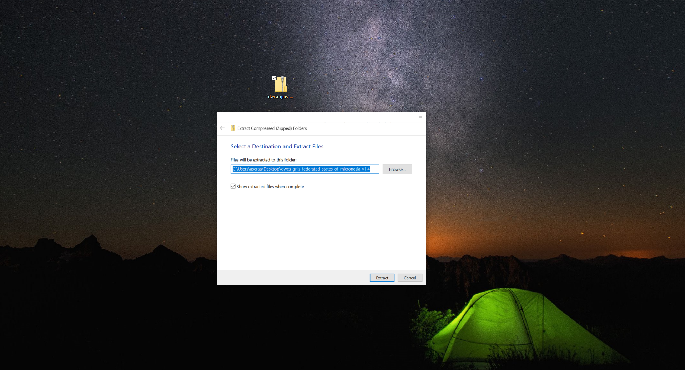
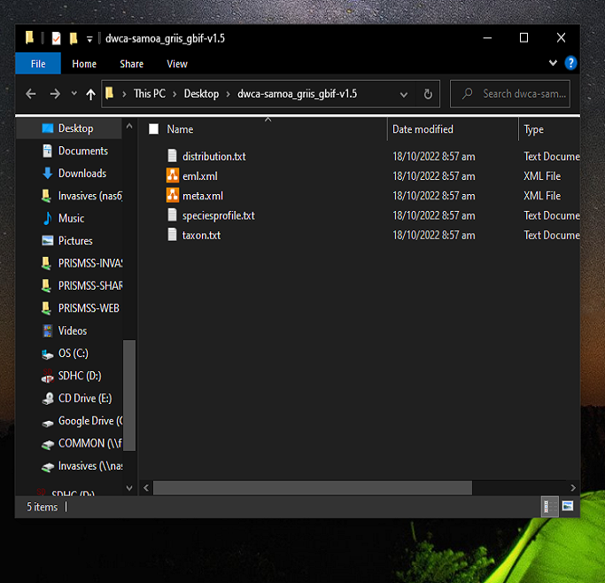

## Invasive Species Specialist Group Checklists

| Checklist Name                                               | Download                                                     | Excel                                                        |
| ------------------------------------------------------------ | ------------------------------------------------------------ | ------------------------------------------------------------ |
| Global Register of Introduced  and Invasive Species - Federated States of Micronesia | [Click here](https://cloud.gbif.org/griis/archive.do?r=griis-federated-states-of-micronesia) | [Click here](..\..\..\ISSG Checklist\ISSG Checklist.xlsx) |
| Global Register of  Introduced and Invasive Species - Marshall Islands | [Click here](https://cloud.gbif.org/griis/archive.do?r=griis-marshall-islands) |                                                              |
| Global Register of Introduced and Invasive Species  - Palau  | [Click here](https://cloud.gbif.org/griis/archive.do?r=palau_griis_gbif) |                                                              |
| Global Register of  Introduced and Invasive Species- Cook Islands | [Click here](https://cloud.gbif.org/griis/archive.do?r=griis-gbif-cook-islands) |                                                              |
| Global Register of Introduced and Invasive Species  - Tonga  | [Click here](https://cloud.gbif.org/griis/archive.do?r=tonga_griis_gbif) |                                                              |
| Global Register of  Introduced and Invasive Species -Samoa   | [Click here](https://cloud.gbif.org/griis/archive.do?r=samoa_griis_gbif) |                                                              |
| Global Register of Introduced and Invasive Species  - American Samoa | [Click here](https://cloud.gbif.org/griis/archive.do?r=american-samoa_griis_gbif) |                                                              |
| Global Register of  Introduced and Invasive Species - Niue   | [Click here](https://cloud.gbif.org/griis/archive.do?r=niue_griis_gbif) |                                                              |
| Global Register of Introduced and Invasive Species  - Pohnpei, Federated States of Micronesia | [Click here](https://cloud.gbif.org/griis/archive.do?r=griis-federated_states_of_micornesia-pohnpei) |                                                              |
| Global Register of  Introduced and Invasive Species - Solomon Islands | [Click here](https://cloud.gbif.org/griis/archive.do?r=solomon_islands_griis) |                                                              |
| Global Register of Introduced and Invasive Species  - Vanuatu | [Click here](https://cloud.gbif.org/griis/archive.do?r=vanuatu-griis-gbif) |                                                              |
| Global Register of  Introduced and Invasive Species - Kosrae, Federated States of Micronesia | [Click here](https://cloud.gbif.org/griis/archive.do?r=federated_states_of_micronesia_kosrae-griis) |                                                              |
| Global Register of Introduced and Invasive Species  - Kiribati | [Click here](https://cloud.gbif.org/griis/archive.do?r=griis-kiribati) |                                                              |
| Global Register of  Introduced and Invasive Species - Yap, Federated States of Micronesia | [Click here](https://cloud.gbif.org/griis/archive.do?r=federated_states_of_micronesia_yap_griis_gbif) |                                                              |
| Global Register of Introduced and Invasive Species  - Chuuk, Federated States of Micronesia | [Click here](https://cloud.gbif.org/griis/archive.do?r=fem_chuuk-griis-gbif) |                                                              |
| Global Register of  Introduced and Invasive Species- Nauru   | [Click here](https://cloud.gbif.org/griis/archive.do?r=griis-nauru) |                                                              |
| Global Register of Introduced and Invasive Species  - New Caledonia, France | [Click here](https://cloud.gbif.org/griis/archive.do?r=griis-new-caledonia) |                                                              |
| Global Register of  Introduced and Invasive Species - Pitcairn Islands- Great Britain | [Click here](https://cloud.gbif.org/griis/archive.do?r=pitcairn_islands_griis) |                                                              |
| Global Register of Introduced and Invasive Species  - Tuvalu | [Click here](https://cloud.gbif.org/griis/archive.do?r=griis-tuvalu) |                                                              |
| Global Register of  Introduced and Invasive Species - Tokelau | [Click here](https://cloud.gbif.org/griis/archive.do?r=griis-tokelau) |                                                              |

### How to open downloaded files in Excel?

1. After downloading you will get a zip file with a name beginning with **dwca-griis**. To extract right click on the file and select extract all

2. Select the location where the files will be extracted and press next.

3. A new window will appear with the files. The file you will focus on is called **taxon**

4. To open the **taxon** file into an excel file please follow the following steps.

   **If you are using Excel on a Windows**

   1. Open Excel
   2. Create a new empty spreadsheet (File → New)
   3. Click the **Data** tab
   4. From "Get External Data", click **From text**
   5. Select the extracted txt file (e.g. **taxon**.txt)
   6. Click **Import**
   7. Select "Delimited" as Data Type and "Unicode (UTF-8)" as File Origin
   8. Click **Finish**
   9. Click **OK** to import data into current sheet

   **If you are using Excel on a Mac**

   1. Open Excel

   2. Create a new empty spreadsheet (File → New)

   3. Import text file (Data → Get Data → From File → From Text/CSV)

   4. Select the extracted text file (e.g. **taxon**.txt)

   5. Select "Tab" as Delimiter and "Unicode (UTF-8)" as File Origin

   6. Click **Load**

      
